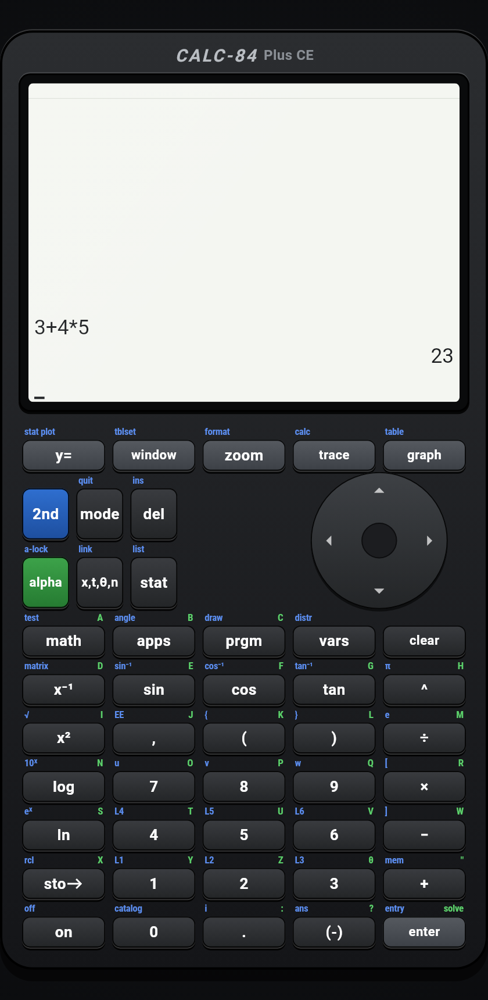
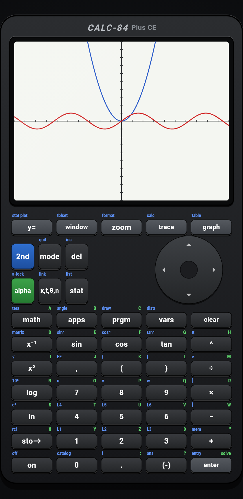
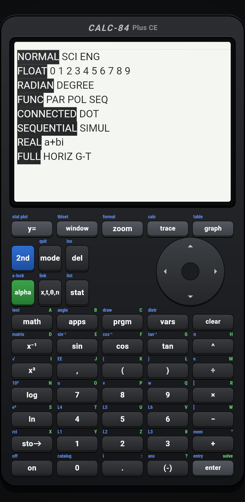

# CALC-84

An open source graphing calculator built with Flutter that recreates a classic
TI-84 Plus CE handheld, right down to the skeuomorphic keys and segmented LCD.
It runs on Android, iOS, macOS, Linux, Windows, and the web.

<p align="center">
  
  
  
</p>

## What it does

- **Graphing** - function, parametric, polar, and sequence modes with tracing,
  zoom, box select, and the full CALC menu (value, zero, min, max, intersect,
  dy/dx, integral).
- **Math** - fractions, complex numbers, hyperbolic and inverse functions,
  roots, logs, permutations, combinations, factorial via gamma, angle and
  DMS conversions.
- **Statistics** - list editor, 1-Var and 2-Var stats, all regressions
  (LinReg, QuadReg, CubicReg, QuartReg, ExpReg, PwrReg, LnReg, Logistic,
  SinReg, Med-Med), frequency lists, and stat plots.
- **Matrices** - editor, arithmetic, inverses, determinants, `ref`, `rref`,
  row operations.
- **Distributions** - normal, t, chi-square, F, binomial, Poisson, geometric,
  plus `rand`, `randInt`, `randNorm`, `randBin`.
- **Finance** - the full TVM solver with N, I%, PV, PMT, FV, P/Y, C/Y.
- **Programming** - a TI-BASIC interpreter with `If`/`Then`/`Else`, loops,
  `For`, `While`, `Repeat`, `Menu`, `Input`, `Prompt`, `Disp`, `Output`,
  labels and `Goto`.
- **Everything else** - solver, tables (auto and ask), memory management,
  catalog, equation history, string variables, and hardware keyboard input.

## Running it

```sh
flutter pub get
flutter run -d chrome   # or any connected device
```

Builds for release:

```sh
flutter build web      # deployed automatically to GitLab Pages
flutter build apk
flutter build macos
```

## Testing

```sh
flutter test              # 330 tests
flutter test --coverage   # 100% line coverage of lib/
```

Golden images under `test/goldens/` are generated by the test suite and are
the same screenshots shown above.

## License

Licensed under the GNU Affero General Public License v3.0 - see
[LICENSE](LICENSE). You can run, study, and modify it freely; if you offer it
as a network service, you must share your source.
